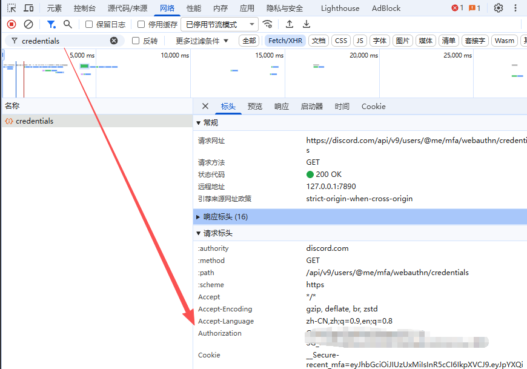

# Discord 消息查看器 (CycleStudies社区)

一个用 Go 编写的 Discord 频道消息查看和抓取工具。

## 📁 项目结构

```
cyclestudies/
├── main.go              # 主程序（Web 查看器）
├── type.go              # 数据结构定义
├── go.mod               # Go 模块依赖
├── img.png              # Token 获取教程截图
├── data/                # 消息数据存储目录
├── scripts/             
│   └── dc_api/          # Discord API 抓取脚本
│       ├── main.go
│       ├── config.json           # ❌ 不提交
│       ├── config.local.json     # ❌ 不提交
│       ├── config.example.json
│       └── README.md
└── .gitignore
```

## 🚀 快速开始

### 1. 获取 Discord Token



**步骤：**
1. 打开 Discord 网页版 (discord.com)
2. 按 `F12` 打开开发者工具
3. 切换到 **Network（网络）** 标签
4. 在 Discord 中进行任意操作（发送消息、切换频道等）
5. 在网络请求中找到任意 `api/v9` 开头的请求
6. 在 **Request Headers** 中找到 `authorization` 字段
7. 复制该值（类似 `MTI4NTgy...` 的长字符串）

### 2. 抓取数据

进入抓取脚本目录：

```bash
cd scripts/dc_api
```

#### 首次使用

```bash
# 1. 复制配置模板
cp config.example.json config.json

# 2. 编辑 config.json，填入你的配置
{
  "channel_id": "你的频道ID",
  "auth_token": "你的Discord Token",
  "proxy_addr": "http://127.0.0.1:7890"
}

# 3. 运行抓取
go run .
```

#### 使用本地覆盖配置（推荐）

如果不想修改 `config.json`，可以创建 `config.local.json` 覆盖：

```bash
# 创建本地配置（仅覆盖需要改的字段）
cat > config.local.json << EOF
{
  "auth_token": "你的真实Token",
  "channel_id": "1445638241280856124"
}
EOF

# 运行（会自动使用 local 配置覆盖）
go run .
```

#### 自定义输出文件

```bash
# 指定输出文件名
go run . -o ../../data/2025-01.json
```

### 3. 运行 Web 查看器

返回项目根目录：

```bash
cd ../..

# 启动 Web 服务
go run .
```

然后访问：`http://localhost:8080`

## ⚙️ 配置说明

### 配置优先级

```
config.local.json  >  config.json  >  默认值
```

### 配置文件说明

| 文件 | 说明 | 是否提交 Git |
|------|------|-------------|
| `config.example.json` | 配置模板 | ✅ 提交 |
| `config.json` | 基础配置 | ❌ 不提交 |
| `config.local.json` | 本地覆盖配置 | ❌ 不提交 |

### 配置字段

```json
{
  "channel_id": "Discord 频道 ID",
  "auth_token": "你的 Discord Token",
  "proxy_addr": "代理地址（可选）"
}
```

**获取频道 ID：**
1. 在 Discord 中右键点击频道
2. 选择 **复制频道 ID**（需要先在设置中开启"开发者模式"）

## 🔒 安全注意事项

⚠️ **重要提醒：**

1. **永远不要提交** `config.json` 或 `config.local.json` 到 Git
2. Discord Token 是敏感信息，**不要分享给他人**
3. 如果 Token 泄漏，立即到 Discord 设置中重置密码
4. 使用 `config.local.json` 存储个人敏感配置

## 📚 功能特性

### 数据抓取（`scripts/dc_api`）

- ✅ 自动分页抓取完整历史消息
- ✅ 支持代理（解决网络限制）
- ✅ Rate Limit 自动处理
- ✅ 配置文件分层管理
- ✅ 自定义输出文件名

### Web 查看器（主程序）

- ✅ 消息时间线显示
- ✅ 图片附件预览
- ✅ 回复关系展示
- ✅ 消息智能合并（5分钟内连发）
- ✅ `@everyone` 高亮显示
- ✅ 优质问题标记
- ✅ 响应式设计

## 🛠️ 开发说明

### 添加新的高亮规则

编辑 `main.go` 中的高亮判定逻辑：

```go
// B. 高亮判定
for _, node := range merged {
    hasEveryone := strings.Contains(node.Content, "@everyone")
    hqQuestion := strings.Contains(node.Content, "优质问题")
    isNewbieQA := strings.Contains(node.Content, "新手问答")
    
    // 🔥 在这里添加新的规则
    customRule := strings.Contains(node.Content, "你的关键词")
    
    if (hasEveryone || hqQuestion || customRule) && !isNewbieQA {
        node.IsMention = true
    }
}
```

### 修改合并时间间隔

默认是 5 分钟内的连续消息会合并，修改：

```go
// main.go 中的 processNodes 函数
diff := curr.RawTime.Sub(last.RawTime)
if diff >= 0 && diff <= 5*time.Minute {  // 🔥 修改这里
    shouldMerge = true
}
```

## 📝 常见问题

### Q: 抓取时提示 "API错误: 401"

**A:** Token 失效或错误，请重新获取 Token。

### Q: 抓取时提示 "Rate Limit"

**A:** 触发了 Discord API 限流，脚本会自动等待 5 秒后重试。

### Q: 如何抓取多个频道？

**A:** 修改 `config.local.json` 中的 `channel_id`，然后指定不同的输出文件：

```bash
# 频道 1
echo '{"channel_id":"111111"}' > config.local.json
go run . -o ../../data/channel1.json

# 频道 2
echo '{"channel_id":"222222"}' > config.local.json
go run . -o ../../data/channel2.json
```

### Q: 代理配置不生效

**A:** 确保代理软件正在运行，并检查端口是否正确（常见端口：7890、10809）。

### Q: 如何更新已抓取的数据？

**A:** 直接重新运行抓取脚本，会覆盖原文件。如果想增量更新，需要手动合并 JSON 文件。

## 📄 许可证

本项目仅供CycleStudies内部使用。

---

**⚠️ 免责声明：** 使用本工具抓取 Discord 数据需遵守 Discord 服务条款。请勿用于商业用途或大规模抓取。
